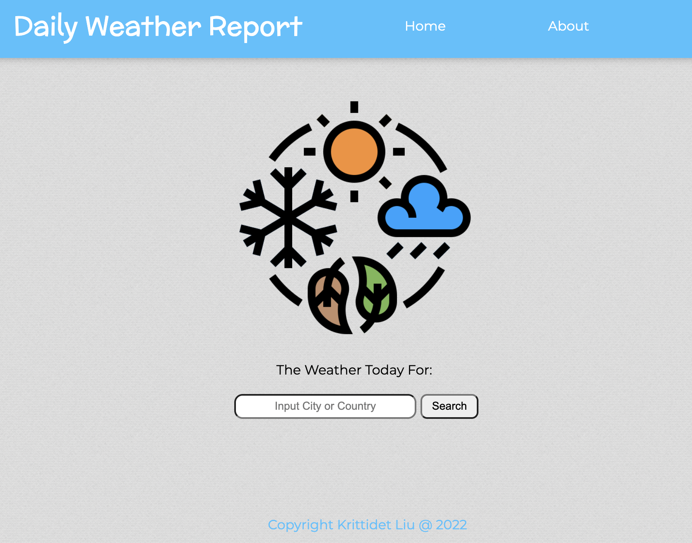
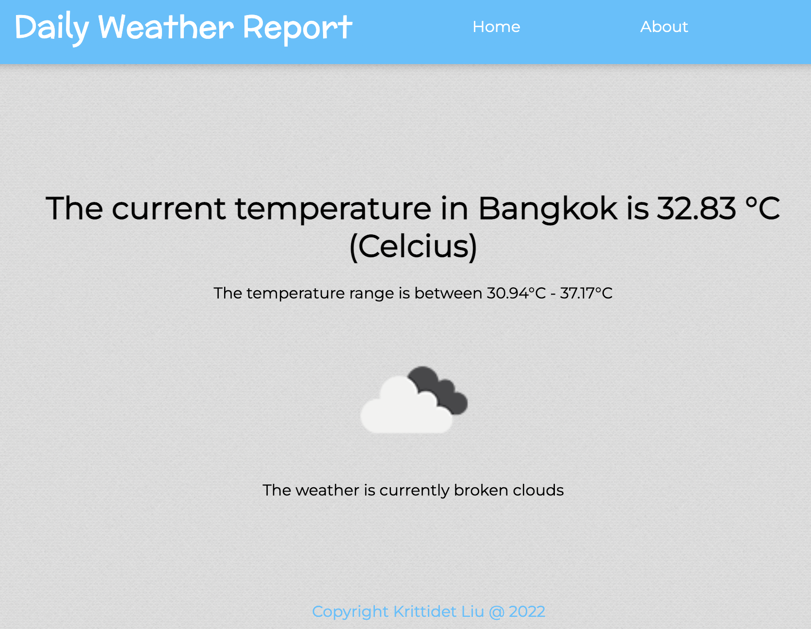

# Weather-React

This is a Weather Web Application project. The website is built using React framework and JavaScript, as well as, HTML and CSS. React API tools used includes browser router, link, useNavigate, useLocation, and hooks. Weather data is retreived from OpenWeatherMap API https://openweathermap.org

Website Link (Project is deployed onto Heroku) --> https://react-weather-web-application.herokuapp.com

**Sample Website**

